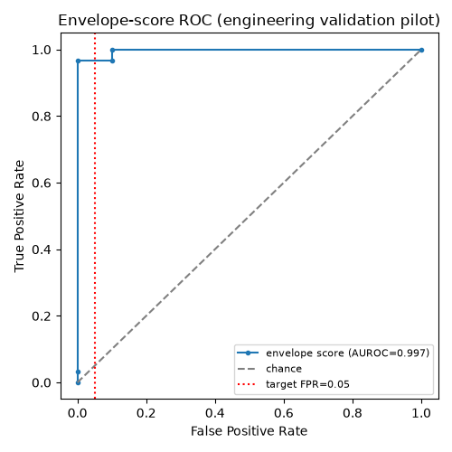
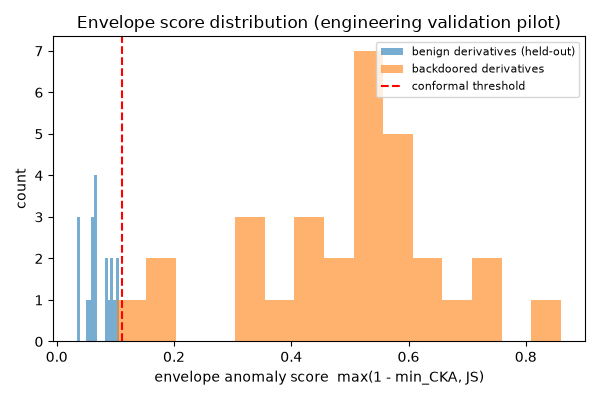
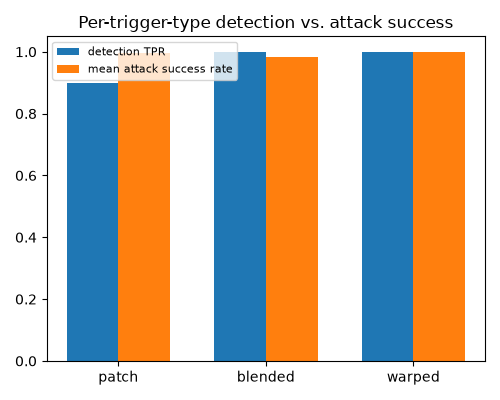

# Engineering Validation Pilot

**This is not Experiments E1–E9, and its numbers must never be pasted
into `02_paper.md`'s Table 1.** That table is specifically the
PreAct-ResNet-18/CIFAR-10/BackdoorBench protocol described in
[`04_experiments_plan.md`](04_experiments_plan.md), and still needs to
be run on real GPU time. This pilot exists to answer a narrower
question first: **does the pipeline's statistical machinery — split-
conformal calibration, the lineage test, the envelope test — actually
work correctly, end to end, before spending that GPU time?**

It runs the same protocol shape (calibrate on held-out populations,
report Clopper-Pearson CIs, TPR at a target FPR, per-trigger-type
breakdown, lineage accuracy against held-out negatives) against
`securemodelgate/demo_models.py`'s small synthetic corpus: a 4-stage
CNN (not ResNet-18) trained on synthetic Gaussian-noise images (not
CIFAR-10), with three simplified trigger types (`patch`, `blended`,
`warped` — see that module's docstrings for exactly how each differs
from its real-attack namesake).

## Reproduce it

```bash
pip install -e ".[dev]"
securemodelgate evaluate --n-independent 40 --n-benign 40 --n-backdoored-per-trigger 10
```

Runtime: ~30 seconds on a 4-core CPU container, no GPU. (Scale up
`--n-independent`/`--n-benign`/`--n-backdoored-per-trigger` for tighter
Clopper-Pearson CIs — e.g. per `conformal.min_calibration_size`, n≥99
per calibration population for a false-block-rate bound at α=0.01.)

## Results (n=40 independent, n=40 benign, n=30 backdoored [10×3 trigger types])

See [`pilot_results/report.md`](pilot_results/report.md) /
[`pilot_results/report.json`](pilot_results/report.json) for the
aggregate output, and
[`pilot_results/evaluation.json`](pilot_results/evaluation.json) for
**one record per model** (110 models: population, transformation, seed,
weight digest, every per-layer S_w score, exemptions, both lineage
thresholds, every per-layer CKA, JS, envelope score and threshold, the
gate's decision, ASR and clean accuracy). Every number below can be
recomputed from that file.

| Metric | Value |
|---|---|
| False-block rate (benign derivatives) | 0/20 = 0.0% (95% CI 0.0%–16.8%) |
| Backdoor TPR @ conformal threshold (α=0.05) | 29/30 = 96.7% (95% CI 82.8%–99.9%) |
| Backdoor TPR @ target FPR=0.05 | 96.7% |
| Envelope-score AUROC | 0.9967 |
| Lineage accuracy (positives vs. held-out negatives) | 69/70 = 98.6% (95% CI 92.3%–100.0%) |
| Median pipeline latency (S_w + D_b only) | ~120 ms |

| Trigger | n | TP | TPR | Mean ASR | Mean clean acc. | Gate decisions |
|---|---|---|---|---|---|---|
| patch | 10 | 9 | 90.0% | 99.6% | 0.613 | 9 ESCALATE, **1 ADMIT** |
| blended | 10 | 10 | 100.0% | 98.5% | 0.594 | 10 ESCALATE |
| warped | 10 | 10 | 100.0% | 99.9% | 0.509 | 9 ESCALATE, 1 BLOCK |

Base clean accuracy on this synthetic 4-class task is 0.54 and benign
test derivatives average 0.64: the task is weak, and accuracy numbers
here are context, not a utility claim.





## What this does and doesn't demonstrate

**Does:**
- **Envelope separation.** AUROC 0.997, but not perfect: the worst
  benign test derivative scores 0.1059 and the best-hidden backdoor
  (`backdoor-patch-3007`, ASR 100%) scores 0.1022, under the 0.1108
  threshold. That backdoor is **admitted end to end**. Non-adaptive
  backdoors are triaged, not guaranteed caught.
- **Lineage.** The lineage rule (median AND per-layer floor AND
  exemption cap, cosine-only scoring) gets 69 of 70 right. It rejects
  all 20 held-out unrelated models and accepts 49 of 50 genuine
  derivatives (20 benign, 30 backdoored). The one miss is
  `backdoor-warped-3009`, whose classifier layer scored 0.484 against a
  0.508 floor (S_w 0.971 against a 0.214 median threshold). It was
  blocked, not admitted, so this is a false reject, not a security
  failure.
- **Speed.** Scoring alone takes about 120 ms per model, before
  attestation signing.

**The false-block rate is still the weak number, for a different reason
than before.** 0/20 held-out benign derivatives were escalated, but
0/20 only bounds the rate below 16.8% (95% CI), and showing ≤ 5% with
zero failures needs n ≥ 59 (one-sided). More importantly, the envelope
only covers derivatives like the calibration ones: fine-tunes 5× longer
than the 8-step calibration recipe are escalated 7/7
([`pilot_results_defensibility/`](pilot_results_defensibility/report.md),
section 8). Real third-party fine-tunes will not be exchangeable with
self-made calibration derivatives; measure the real rate.

> **Correction (2026-10-01): the earlier 2/20 = 10% was measured on a
> leaky test set.** The per-model output added for the developer
> checklist ([`13_developer_checklist_answers.md`](13_developer_checklist_answers.md))
> showed that the benign population's pruned and quantized members were
> pruned/quantized copies of the *base itself* — deterministic, so
> repeated: only 11 of 20 calibration and 11 of 20 test models were
> distinct, and 13 of the 20 test models were byte-identical to
> calibration models. The only genuinely held-out benign models were 7
> fine-tunes, and 2 of those 7 were escalated (the two "false blocks",
> seeds 2030 and 2033, JS 0.098 and 0.106 against a 0.0915 threshold).
> Every benign derivative now starts from its own seeded fine-tune,
> `run_evaluation` refuses any calibration/test overlap, and the numbers
> above are the re-run. The threshold rose from 0.0915 to 0.1108 because
> the calibration set now carries real fine-tune variance, which is also
> why one patch backdoor now gets through.

> **Revision notes.** This number has moved four times, each time because
> this pilot process surfaced a real problem rather than confirming a
> guess:
>
> 1. An early run reported 98.6% (69/70) with S_w values for genuine
>    derivatives and independent models clustered within 0.002 of each
>    other (~0.50). That was a real bug in
>    `lineage_score.match_named_parameters`, which was matching ALL
>    named parameters, including 1D BatchNorm affine weight/bias —
>    params that PyTorch initializes to all-ones/all-zeros and that
>    stay close to that shared initial value regardless of true
>    lineage, swamping the genuine signal from the 2D conv/linear
>    weight matrices Section 3.2 actually describes. Restricting to 2D+
>    parameters widened the separation to ~1.00 vs. ~0.50 and produced
>    a 100% (70/70) figure.
> 2. Testing Section 3.2's permutation-invariance claim directly
>    (rather than trusting the linear-algebra argument for it) found
>    that claim was also wrong as stated — see
>    [`09_permutation_robustness_pilot.md`](09_permutation_robustness_pilot.md).
>    Fixing it (channel-matched rather than flattened cosine similarity)
>    is a net improvement — it stops a real, function-preserving
>    permutation from causing a false rejection — but its assignment
>    procedure also inflates independent models' baseline S_w somewhat,
>    which is what moved lineage accuracy back to 98.6% (69/70). Both
>    numbers are real measurements, not a story picked after the fact;
>    see `tests/test_pipeline.py::test_excluding_1d_parameters_widens_lineage_separation`
>    and `test_single_layer_channel_permutation_is_fully_recovered` for
>    the regression tests behind each fix.
> 3. After the per-layer floor, sequential alignment and the exemption
>    cap were added
>    ([`10_critical_review_pilot.md`](10_critical_review_pilot.md) items
>    2 and 7), a re-run under the then-default 50/50 spectral blend gave
>    **92.9% (65/70)**. All five errors were warped-trigger backdoored
>    fine-tunes whose classifier layer fell just under the floor.
> 4. The spectral ablation (item 12) showed spectra compress the margin,
>    so the default became cosine-only. The current run gives **98.6%
>    (69/70)**. That choice was made on this corpus, Pilot A's own
>    population included, so it needs the real-model run to confirm it.

**Doesn't:** say anything about real images, real ResNet-18-scale
models, or the specific attacks (BadNets/Blended/WaNet/SIG/Input-aware)
BackdoorBench implements — `warped` here is an explicit non-faithful
stand-in for WaNet (see `demo_models.apply_trigger`'s docstring), and
`patch`/`blended` are simplified versions of their namesakes on
synthetic rather than natural images. A near-perfect AUROC on a task
this small and this separable is expected, not a claim that the real
evaluation will look the same — small, clean synthetic data is
intentionally easy. Treat this pilot as "the wiring works," not as an
early version of the paper's actual result.
