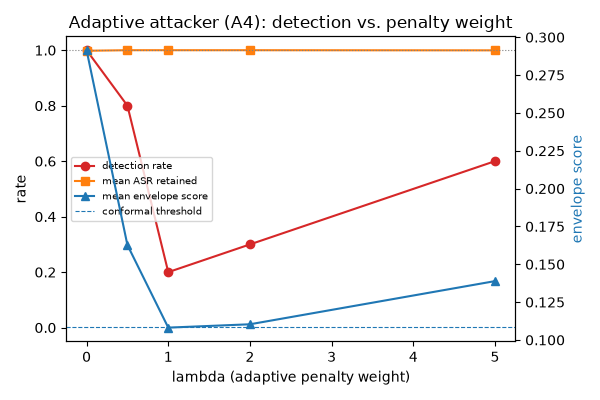

# Adaptive-Attacker (A4) Pilot

Section 2 of the paper defines the A4 adversary: knows the full
algorithm, the public probe pool, and the calibration procedure, but
not the per-admission probe seed. The original Parasparam review flagged
excluding adaptive attacks as security-through-obscurity — this pilot is
the honest answer to "what happens when the attacker actually knows what
the envelope score measures and optimizes against it directly."

**This is a pilot on the synthetic corpus, like
[`06_engineering_validation_pilot.md`](06_engineering_validation_pilot.md)
— not Experiment E7 on the paper's real BackdoorBench/ResNet-18 setup.**
The specific λ at which detection breaks down will not transfer to that
setup. The qualitative finding — a knowledgeable adaptive attacker CAN
drive the envelope score below the conformal threshold while keeping
the backdoor fully functional — is architecture-independent and should
inform how the paper talks about adaptive-attack resilience regardless
of scale.

## How it works

`securemodelgate/adaptive_attack.py` reimplements the envelope score
(`max(1 - min-layer linear CKA, JS divergence)`) in torch, numerically
checked against the scoring implementation in
`lineage/behavioral_delta.py` to within 1e-8
(`tests/test_adaptive_attack.py`). A poisoned derivative is then trained
with loss = poisoned cross-entropy + `λ · envelope_score`, i.e. the
attacker directly penalizes the exact quantity the gate will compute at
admission time — the strongest fair test available, per Kerckhoffs'
principle.

## Reproduce it

```bash
securemodelgate adaptive --n-benign-calibration 20 --lambdas 0.0 0.5 1.0 2.0 5.0 --n-per-lambda 10
```

Runtime: ~55s on 4 CPU cores, no GPU.

## Results

See [`pilot_results_adaptive/report.md`](pilot_results_adaptive/report.md)
/ [`report.json`](pilot_results_adaptive/report.json) for the full
output.

Envelope conformal threshold (α=0.05, n=20 benign calibration models): **0.1087**

| λ | n | Detected | Mean ASR retained | Mean envelope score |
|---|---|---|---|---|
| 0.0 | 10 | 10/10 = 100.0% (95% CI 69.2%–100.0%) | 99.8% | 0.2914 |
| 0.5 | 10 | 8/10 = 80.0% (95% CI 44.4%–97.5%) | 100.0% | 0.1627 |
| 1.0 | 10 | 2/10 = 20.0% (95% CI 2.5%–55.6%) | 100.0% | 0.1082 |
| 2.0 | 10 | 3/10 = 30.0% (95% CI 6.7%–65.2%) | 100.0% | 0.1104 |
| 5.0 | 10 | 6/10 = 60.0% (95% CI 26.2%–87.8%) | 100.0% | 0.1389 |



## Reading this honestly

- **The backdoor never gets weaker.** ASR retained is ≥99.8% at every
  λ — the adaptive penalty costs the attacker nothing in attack
  effectiveness, at least at this model/task scale.
- **Detection collapses fast.** 100% → 20% between λ=0 and λ=1.0. The
  envelope score is not robust to an attacker who optimizes against it
  directly, and the paper should say this plainly rather than imply the
  envelope test is adaptive-attack-proof.
- **Detection is non-monotonic in λ** (20% at λ=1.0, back up to 60% at
  λ=5.0) — almost certainly SGD optimization noise at n_per_lambda=10,
  not a real U-shaped robustness curve. A larger n and a learning-rate
  schedule tuned per λ would be needed before treating the exact shape
  as meaningful; the collapse from λ=0 to λ≈1 is the robust part of this
  finding, not the curve's exact shape past that point.
- **What this does NOT show:** whether a defender-side countermeasure
  (e.g., an ensemble of probe pools, a held-out CKA layer subset the
  attacker doesn't optimize against, detecting the distributional
  signature of adaptive training itself) recovers detection. That is
  future work, not something this pilot attempted.

## What probe pool did the attacker actually train against?

This matters directly: Section 2's A4 gives the attacker the public
probe pool and the algorithm, but explicitly withholds the
**per-admission probe seed, committed before scoring** — that seed
commitment is the paper's stated defense against an attacker who might
otherwise overfit to the exact images the gate will score against.
Checked directly against the code (`adaptive_attack.py`,
`make_adaptive_backdoored_derivative`):

- **Training time:** each of the 80 SGD steps draws a FRESH batch of 16
  probe images, `synthetic_batch(16, seed=20260101 * 100 + step)` — a
  different seed (and therefore different images) on every step, not one
  fixed batch reused throughout training.
- **Evaluation time:** the admission-time probe pool is
  `demo_models.make_probe_loader(seed=20260101)` — 64 images generated
  once from a single fixed seed, reused identically for every model
  scored in this pilot (`adaptive_evaluation.py`,
  `evaluation.py`, and the CLI all hardcode `probe_seed=20260101`).

So the attacker in this pilot did **not** train against the literal,
fixed evaluation-time probe pool — it trained against 80 distinct
resampled batches, none of which is the exact 64-image pool used for
scoring. Taken at face value, that looks like the per-admission-seed
defense held.

**It didn't really get tested, though, and that's the more important
point to state plainly.** `synthetic_batch(seed)` draws i.i.d. Gaussian
noise from the same fixed generative process for any seed, labeled by a
deterministic function of channel means — there is no natural-image
structure for a model to overfit to in one specific draw versus another.
Training against 80 fresh draws from that distribution is not
meaningfully different from training against the one draw used at
eval time; both are draws from a distribution the attacker already knows
completely (Kerckhoffs' principle grants it). The paper's stated
defense — that withholding the exact committed seed denies the attacker
a specific target to overfit to — presumes there is something
seed-specific worth overfitting to. On this synthetic corpus there
isn't, so this pilot's 100%→20% collapse is not evidence that the
seed-commitment defense is either working or failing; it is evidence
that an attacker with full knowledge of the probe DISTRIBUTION (which
this pilot always grants, seed or no seed) can already drive detection
down substantially. Whether committing a genuinely unpredictable seed
adds protection on real image data, where a specific probe draw does
carry exploitable structure an attacker denied that exact draw cannot
see in advance, is untested and stays open for Experiment E7 on the
real corpus — that experiment should explicitly compare an attacker who
trains against the exact eval-time probe pool (upper bound on attacker
knowledge) with one who only has the distribution (this pilot's setup),
to see whether the gap the paper's design assumes actually appears.

## Implication for the paper

Section 2's A4 description ("the adversary may add fingerprint-matching
regularisers during backdoor training") is accurate, but Section 3's
justification for CKA/JS ("A backdoor must add a new feature-to-target
mapping, which we hypothesise lowers late-layer CKA and raises output
divergence... more than benign fine-tuning does") should be read
alongside this result: that hypothesis holds for a *non-adaptive*
attacker (λ=0 detects 100%), but explicitly does not hold once the
attacker optimizes against it. The paper's abstract and Section 3
already frame detection as "calibrated triage, not a detection
guarantee" — this pilot is evidence for exactly that framing, not
against it, and a concrete number (λ≈1 breaks it, at this scale) to
cite instead of an unquantified caveat.
